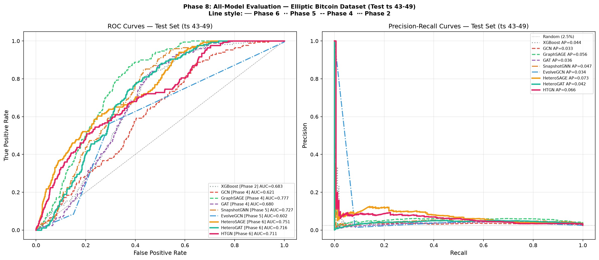
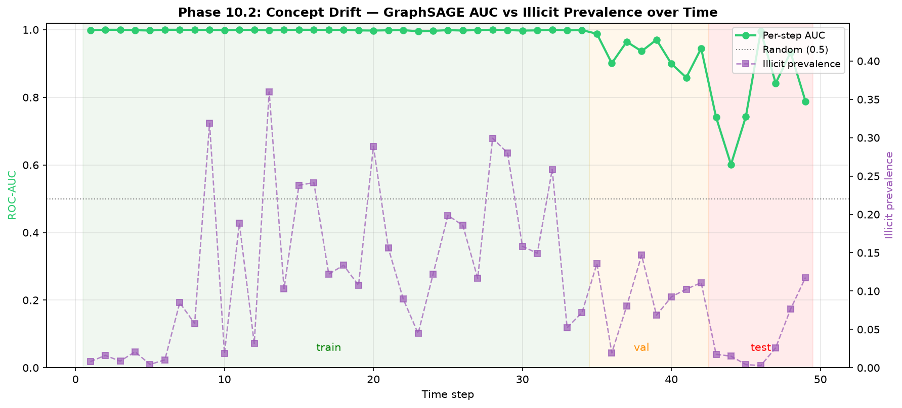

# Spatio-Temporal GNN Anomaly Detection — When Simple Beats Complex

Detecting illicit transactions in the **Elliptic Bitcoin** graph with a full
ladder of models — from an XGBoost baseline up to a Heterogeneous Temporal GNN —
to measure exactly what graph structure and temporal memory buy you under
**real-world concept drift.**

Built **end to end on $0 of free tooling**: local CPU + free Colab/Kaggle GPU,
free data, free hosting. No paid cloud, anywhere.

> **TL;DR** — The fanciest model (Heterogeneous Temporal GNN) wins on
> same-distribution validation (**val AUC 0.960**), but a plain **GraphSAGE wins
> where it counts** — on the temporally-shifted test set (**test AUC 0.777,
> +14% over XGBoost**). Under concept drift, **simple inductive bias generalises
> better than complex temporal memory.** That negative result *is* the finding.

---

## Headline results

All models trained transductively on the same temporal split (no label leakage).
**ROC-AUC is the reliable metric here** — F1 collapses on the test set for *every*
model because illicit prevalence drops from 11.6% (train) → 2.5% (test), so the
absolute scores below are diagnostic of drift, not of model failure.

| Model | Phase | Val AUC | **Test AUC** | Val F1 | Params | Latency (full graph) |
|-------|:-----:|:-------:|:------------:|:------:|:------:|:--------------------:|
| XGBoost (features only) | 2 | 0.972 | 0.683 | 0.914 | — | 16 ms¹ |
| GCN | 4 | 0.887 | 0.621 | 0.609 | 15k | 194 ms |
| **GraphSAGE** ⭐ | 4 | 0.936 | **0.777** | 0.764 | 30k | 275 ms |
| GAT | 4 | 0.929 | 0.680 | 0.653 | 15k | 388 ms |
| SnapshotGNN (temporal) | 5 | 0.948 | 0.727 | 0.754 | 55k | 447 ms |
| EvolveGCN (temporal) | 5 | 0.795 | 0.602 | 0.443 | 69k | 320 ms |
| HeteroSAGE | 6 | 0.950 | 0.751 | 0.744 | 60k | 764 ms |
| HeteroGAT | 6 | 0.927 | 0.716 | 0.669 | 31k | 735 ms |
| **HTGN** (Hetero + Temporal) | 6 | **0.960** | 0.711 | **0.801** | 85k | ~7,254 ms |

<sub>¹ XGBoost timed on the test set only; GNNs run full-batch over all 203k nodes. Best **test** generalisation in **bold ⭐**; best **val** in **bold**.</sub>



---

## The narrative: simplicity beats complexity under concept drift

The Elliptic dataset has a severe, *built-in* temporal distribution shift —
illicit prevalence collapses across the timeline:

```
illicit prevalence:   11.6%  (train, ts 1–34)
                  →    9.2%  (val,   ts 35–42)
                  →    2.5%  (test,  ts 43–49)
```

This makes Elliptic a near-perfect stress test for the question every fraud team
actually cares about: **does my model still work next month?**

The model ladder gives a clean answer:

1. **Graph structure helps generalise.** GraphSAGE lifts test AUC to **0.777**,
   **+14% over the feature-only XGBoost baseline (0.683)**. The graph carries
   cross-temporal signal that tabular features alone don't.

2. **More temporal memory hurts under drift.** SnapshotGNN and EvolveGCN add a
   GRU over time. They improve *validation* but lose on *test* (0.727 / 0.602 vs
   GraphSAGE's 0.777) — the temporal context **overfits patterns in ts 1–34 that
   don't persist** in ts 43–49.

3. **The most complex model wins the wrong benchmark.** HTGN (heterogeneous +
   temporal, 85k params) takes the **highest val AUC (0.960)** — and the **worst
   Phase-6 test AUC (0.711)**. It's the textbook trap: pick a model on the
   validation distribution, ship it, and watch it degrade as the world moves.

4. **The cheap inductive bias is the robust one.** GraphSAGE's mean-aggregation
   has no temporal memory to overfit. It's also the **fastest GNN (275 ms)** and
   among the smallest (30k params). Less to learn, less to over-learn.

> **Takeaway for practitioners:** evaluate on a *time-shifted* test set, not a
> random split — and don't assume the heaviest architecture is the safe choice.
> Under drift, **inductive simplicity is a feature, not a compromise.**



Interpretability (SHAP + GAT attention, Phase 9) corroborates this: in Elliptic's
sparse graph (mean degree 2.3), GraphSAGE's score is driven mostly by a node's
**own feature vector** — self-loop attention dominates (~70%), and even
fully isolated cold-start nodes score well (AUC only drops 0.777 → 0.680 with all
edges removed). Robustness probing (Phase 10) found the model resists Gaussian
noise and structural attacks but is vulnerable to **feature camouflage** — the
same feature-reliance that makes it robust to drift is its main attack surface.

---

## Live demo

An interactive **Streamlit dashboard** explores all of the above — anomaly scores
over the 49 time steps, model comparison, the concept-drift dissection,
interpretability, and scalability.

```bash
streamlit run dashboard/app.py
```

Runs locally with zero inference cost (all results are pre-computed in
`results/`). Deploys free on **[Streamlit Community Cloud](https://streamlit.io/cloud)**
— connect this repo, set the main file to `dashboard/app.py`.

> _Live URL: to be added after public deploy._

---

## Dataset

**[Elliptic Bitcoin Dataset](https://www.kaggle.com/datasets/ellipticco/elliptic-data-set)**
— a real, labeled Bitcoin transaction graph.

| | |
|---|---|
| Nodes (transactions) | 203,769 |
| Edges (payment flows) | 234,355 |
| Time steps | 49 (edges stay within a step) |
| Features / node | 169 (165 original + degree ×3 + normalised time) |
| Labels | 4,545 illicit · 42,019 licit · 157,205 unknown (77%) |

Downloaded via the no-auth PyG mirror (`data.pyg.org/datasets/elliptic`); the
free Kaggle API is documented as a fallback. Raw data is gitignored and
re-downloadable. Details in [`docs/dataset.md`](docs/dataset.md).

---

## Reproduce from a clean clone

Everything is seeded (`seed=42`) and deterministic on CPU. Full hyperparameters,
split boundaries, and versions live in
[`config/experiments.yaml`](config/experiments.yaml).

```bash
git clone <repo-url>
cd spatio-temporal-fraud-detection

python -m venv venv
venv\Scripts\Activate.ps1          # Windows PowerShell
# source venv/bin/activate         # macOS / Linux

# This was developed on Windows-on-ARM (no GPU); use binary wheels:
pip install --only-binary=:all: -r requirements.txt
```

Then run the pipeline in order:

```bash
python -m src.data.download_elliptic         # Phase 1.1 — fetch dataset
python -m src.data.preprocess_elliptic       # Phase 1.3 — clean + encode
python -m src.data.feature_engineering       # Phase 1.4 — 169 features
python -m src.data.temporal_split            # Phase 1.5 — no-leak time split
python -m src.data.build_graph               # Phase 3.1 — graph.pt

python -m src.models.baseline_xgboost        # Phase 2  — XGBoost baseline
python -m src.models.static_gnn_train        # Phase 4  — GCN / GraphSAGE / GAT
python -m src.models.temporal_gnn_train      # Phase 5  — SnapshotGNN / EvolveGCN
python -m src.models.hetero_gnn_train        # Phase 6  — HeteroSAGE / HGAT / HTGN

python -m src.evaluation.comprehensive_eval  # Phase 8  — metrics + ROC for all 9
python -m src.evaluation.reproducibility     # Phase 11 — verify determinism
```

The reproducibility check confirms two eval-mode forward passes are
bit-identical and recomputed metrics match this README within 1e-4
(see [`results/reproducibility_check.md`](results/reproducibility_check.md)).

### No local GPU? Use a free one.

Heavy training optionally runs on **free Google Colab / Kaggle** GPU via
[`notebooks/colab_setup.ipynb`](notebooks/colab_setup.ipynb) (installs deps,
clones the repo). All checkpoints in this repo were produced on CPU and are <1 MB,
so they stay in git — no model hosting needed.

---

## Project structure

```
spatio-temporal-fraud-detection/
├── data/             # raw + processed graphs (gitignored; re-downloadable)
├── notebooks/        # EDA + free Colab/Kaggle GPU runner
├── src/
│   ├── data/         # download, preprocess, features, splits, graph build
│   ├── models/       # XGBoost + 8 GNN architectures + training
│   └── evaluation/   # metrics, interpretability, robustness, scalability, repro
├── config/           # experiments.yaml (all HPs/seeds) + model_registry.json
├── results/          # metrics (JSON/CSV/MD) + plots (PNG) — all pre-computed
├── dashboard/        # Streamlit demo (app.py)
├── docs/             # dataset + baseline-expectations notes
└── requirements.txt  # pinned, free, open-source deps
```

Each module is runnable standalone (`python -m src.<module>`); the full
reproduction order is listed above.

---

## What's deliberately out of scope

This is an **analysis / research project**, not a deployed service. There is no
REST API or container layer — the Streamlit dashboard is the interface, and all
results are reproducible from the scripts above. The focus is the *finding*
(simplicity vs. complexity under drift), not productionisation.

---

## $0-budget guarantee

Compute (local CPU + free Colab/Kaggle GPU), data (PyG/Kaggle mirror), demo
(Streamlit Community Cloud) — **every dependency and service is free.** No
AWS/GCP/Azure paid tiers were used at any point.

---

## License

Code: [MIT](LICENSE). The Elliptic dataset retains its original license/terms.
